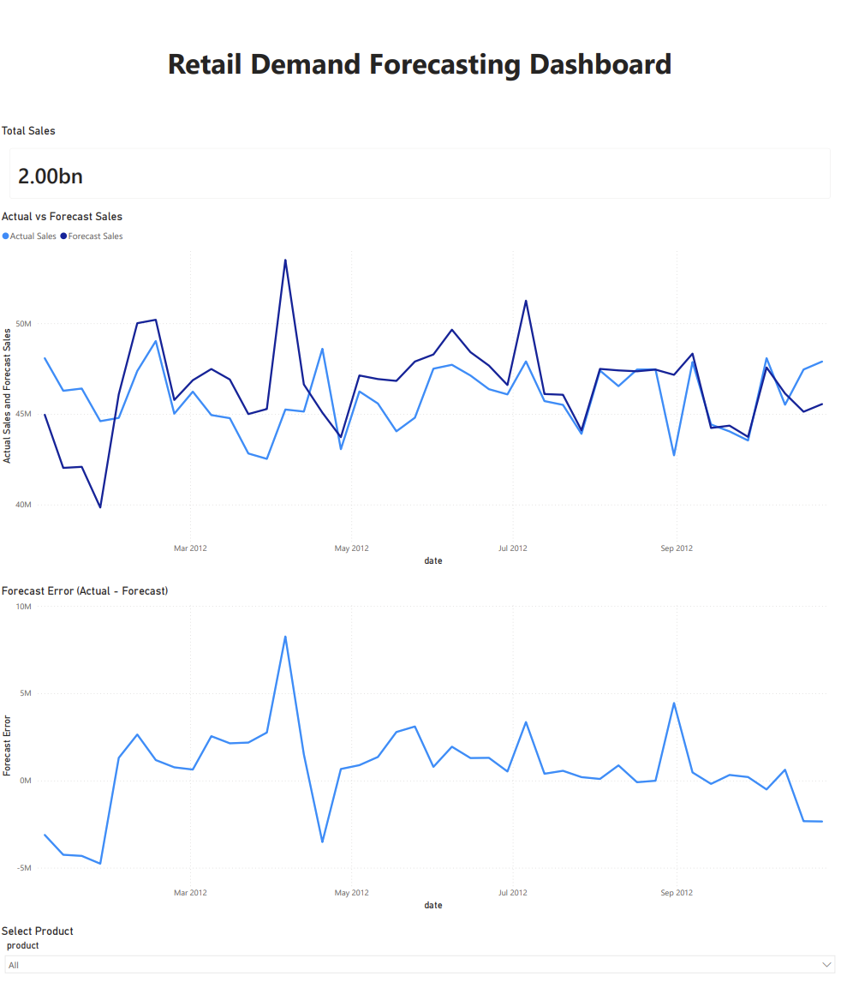

# Retail Demand Forecasting Dashboard

This project presents a Power BI dashboard analyzing retail sales forecasting.

## Tools
- Power BI
- DAX
- Data Visualization

## Key Features
- Actual vs Forecast Sales trend analysis
- Forecast Error tracking
- Product filtering

## Dashboard Preview

## Insights
The dashboard highlights differences between forecasted and actual sales, helping identify forecasting inaccuracies.
